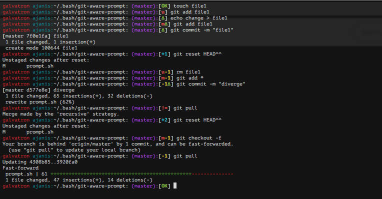

# Git Aware Prompt

Based on https://github.com/jimeh/git-aware-prompt

Improved git status flags based on: https://github.com/Teagan42/GitAwareBash.git

Adds symbols indicating git status:

- [OK]  No local or remote changes
- [m] Unstaged changes
- [u] Untracked files
- [∆] Uncommitted changes
- [+N] Local changes ready to be pushed
- [-N] New remote changes

## Preview




## Installation
```
    mkdir -p "$HOME/.bash"
    git clone https://github.com/ajanis/git-aware-prompt "$HOME/.bash/git-aware-prompt"
```

Then in your `~/.bash_profile` add these lines:

```
    export GITAWAREPROMPT="${HOME}/.bash/git-aware-prompt"
    source "${GITAWAREPROMPT}/main.sh"
```

And override `PS1` to look something like this including the vars `$git_branch` and `$git_dirty`

```
    export PS1="\[$txtred\]\h\[$txtcyn\] \u:\[$txtrst\]\w\[$txtwht\]\[$txtrst\]:\[$txtpur\]\$git_branch\[$txtrst\]\$git_status "
```
